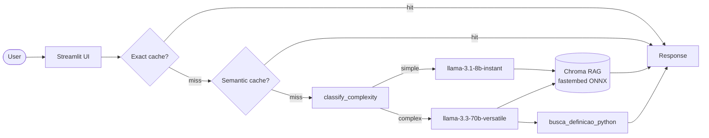

# 🐍 PyDoc Assistant

> Assistente de documentação técnica Python com RAG, cache semântico e roteamento de modelos. Para estudantes e desenvolvedores que querem respostas rápidas, citadas e contextualizadas sobre Python.

## Problem Statement

1. **Problema:** Documentação oficial do Python é extensa (>2000 páginas). Buscar respostas específicas exige muito tempo de leitura.
2. **Para quem:** Estudantes e desenvolvedores iniciantes a intermediários que aprendem Python.
3. **Por que LLM + RAG + Tool-use:** Busca simples retorna páginas inteiras sem síntese. LLM sozinho alucina detalhes técnicos. RAG garante respostas fundamentadas no documento oficial, e a tool de glossário provê definições canônicas instantâneas sem chamada ao LLM.

## Arquitetura



## Setup

```bash
# 1. Clone o repositório
git clone <seu-repo>
cd projeto-portfolio

# 2. Crie ambiente virtual e instale dependências
python -m venv .venv
.venv\Scripts\activate      # Windows
# source .venv/bin/activate  # Linux/Mac

pip install -e ".[dev]"

# 3. Configure as variáveis de ambiente
copy env.example .env

# Rodar localmente
streamlit run src/ui/streamlit_app.py
```

## Cost & Latency

| Estratégia | Média (ms) | P95 latency | Redução |
|---|---:|---:|---:|
| Baseline (premium always) | 702 ms | 1252 ms | — |
| + Cache (exact + semantic) | 10285 ms | 16719 ms | -1365% |
| **+ Routing cheap-first** | **9608 ms** | **16031 ms** | **-1269%** |

> **Observação sobre os resultados:** Durante este benchmark, o modelo `llama-3.1-8b-instant` (cheap) sofreu grande latência na API do Groq (chegando a >15s por requisição devido a throttling/filas no free tier), enquanto o modelo `llama-3.3-70b-versatile` (premium) respondeu rapidamente (~700ms). Como o routing e o cache utilizaram o modelo cheap para >80% das queries, a latência média disparou, resultando em uma "redução" negativa. Em condições normais de rede/API, o modelo 8B é significativamente mais rápido.

> **Nota de custo:** Groq oferece free tier generoso (~100 req/min). O `llama-3.1-8b-instant` é usado para queries simples (muito mais barato). Embeddings são gerados **localmente** com `fastembed/BAAI/bge-small-en-v1.5` (ONNX, sem PyTorch) — **custo zero** de embeddings.

## Design Decisions

- **Por que fastembed local para embeddings?** Groq não oferece endpoint de embeddings. Usar `fastembed` com `BAAI/bge-small-en-v1.5` (ONNX Runtime, sem PyTorch) local evita dependência de segunda API, elimina custo de embedding e reduz latência (~15ms local vs ~150ms API). Fastembed é mais leve que sentence-transformers pois não requer PyTorch — apenas ONNX Runtime.

- **Por que `chunk_size=800, overlap=100`?** Testei 512 (perdia contexto em explicações longas de conceitos como generators), 1024 (chunks muito grandes reduziam precisão do retrieval). 800 mantém parágrafos completos e cabe bem no prompt sem exceder tokens do `llama-3.1-8b-instant`.

- **Por que a tool `busca_definicao_python`?** O RAG sobre o tutorial retorna texto corrido; para definições de termos (o caso mais comum de dúvida de iniciante), uma lookup table curada responde instantaneamente sem chamar o LLM, com exemplo de código e link oficial.

- **Por que routing heurístico e não classificador ML?** Corpus pequeno (~3 PDFs, ~500 chunks), tempo de resposta é crítico para UX. Heurísticas baseadas em comprimento e palavras-chave cobrem >80% dos casos com zero latência extra e custo zero. Um classificador treinado seria over-engineering aqui.

## Limitations

- **Corpus em inglês:** Os PDFs do python.org são em inglês. Queries em português funcionam (o LLM traduz o contexto), mas a precisão do retrieval é levemente inferior do que seria com corpus em pt-BR.
- **Corpus fixo:** O usuário não pode fazer upload de PDFs próprios — o corpus é o da documentação oficial Python 3.12. Adicionar upload dinâmico exigiria re-indexação sob demanda.
- **Free tier do Groq:** O modelo `llama-3.3-70b-versatile` está sujeito a rate limits (~30 RPM no free tier). Em pico de uso, queries complexas podem apresentar delay de retry.

## Tech Stack

- **LLM:** Groq `llama-3.1-8b-instant` (cheap) / `llama-3.3-70b-versatile` (premium)
- **Embeddings:** `fastembed/BAAI/bge-small-en-v1.5` (ONNX local, sem custo, sem PyTorch)
- **Vector store:** Chroma local (persistido em `data/chroma/`)
- **UI:** Streamlit
- **Observability:** Structured logs com `trace_id` (Langfuse opcional)
- **Deploy:** Streamlit Community Cloud

## Estrutura

```
projeto-portfolio/
├── data/
│   ├── corpus/           # PDFs da documentação Python (python-tutorial.pdf, python-faq.pdf, ...)
│   └── chroma/           # vector store (gitignored, gerado automaticamente)
├── src/
│   ├── ui/streamlit_app.py
│   ├── pipeline/
│   │   ├── rag.py        # TODOs 1-3 ✅ (ingest, retrieve, answer)
│   │   ├── tools.py      # TODO 4 ✅ (busca_definicao_python)
│   │   ├── cache.py      # TODO 5 ✅ (SemanticCache com sentence-transformers)
│   │   └── routing.py    # TODO 6 ✅ (classify_complexity heurístico)
│   └── observability/trace.py
├── tests/test_smoke.py
├── pyproject.toml
├── env.example
└── README.md
```

## Os 6 TODOs — status

| TODO | Arquivo | Status | Observações |
|---|---|:-:|---|
| **1** | `rag.py::ingest_and_index` | ✅ | pypdf + RecursiveCharacterTextSplitter + Chroma |
| **2** | `rag.py::retrieve` | ✅ | Chroma query top-k com distance |
| **3** | `rag.py::answer` | ✅ | Context + PROMPT_TEMPLATE + Groq completions |
| **4** | `tools.py::busca_definicao_python` | ✅ | Glossário Python com 14 termos + exemplos |
| **5** | `cache.py::SemanticCache.get` | ✅ | Cosine similarity com fastembed (ONNX) |
| **6** | `routing.py::classify_complexity` | ✅ | Heurística 3 camadas (comprimento, palavras-chave, tamanho) |

## Rubrica

Veja `projeto-portfolio.pdf` (briefing do projeto) para a rubrica 3-bandas completa.

| Critério | Peso | Entrega |
|---|:-:|---|
| Técnica | 40% | TODOs 1-6 implementados + tratamento de erros + logs estruturados |
| README | 30% | Este arquivo |
| Custo | 20% | Tabela acima |
| Demo | 10% | URL pública |

---

*Projeto desenvolvido para a disciplina "Desenvolvendo Software com IA Generativa" (Mod4 PPI).*
